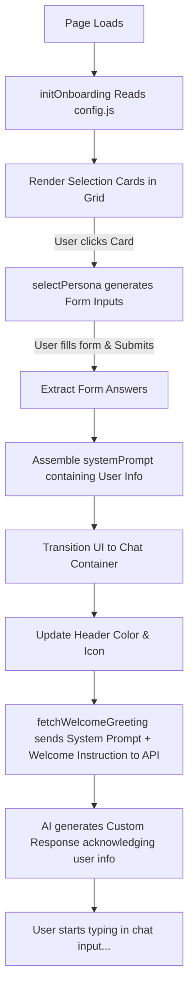

# AI Chatbot 🤖

A clean, responsive, and modern web-based AI assistant powered by **LLaMA 3.3 (via the Groq API)**. Built entirely with vanilla HTML, CSS, and JavaScript, it requires zero build tools or package managers—just open and chat!

This project has been upgraded to include a **customizable Onboarding Screen** where users select a specialist (e.g., Health Specialist, Dietitian, Gym Trainer), answer a few personalized intake questions, and then chat with a custom AI persona.

---

## ✨ Features

- **Direct API Integration**: Communicates directly with the ultra-fast Groq API.
- **LLaMA 3.3 Powered**: Uses the `llama-3.3-70b-versatile` model for intelligent, context-aware responses.
- **Onboarding Selector**: Interactive selector screen to choose from multiple wellness specialists.
- **Dynamic Intake Forms**: Form fields are generated programmatically based on the selected advisor's needs.
- **Tailored Prompting**: The chatbot automatically learns your answers and adapts its secret instruction (System Prompt) and first greeting message!
- **Conversational Context**: Maintains message history during the session to enable continuous dialogue.
- **Modern UI/UX**:
  - Fully responsive layout that looks great on mobile, tablet, and desktop.
  - Smooth typing indicator.
  - Active color accents matching the selected specialist.
  - Setup notices to guide user configuration.
  - Custom scrollbars and styling powered by the Inter font.
- **Zero Dependencies**: Pure HTML5, CSS3, and ES6+ JavaScript.

---

## 🛠️ Tech Stack

- **Structure**: [HTML5](https://developer.mozilla.org/en-US/docs/Web/HTML)
- **Styling**: [CSS3](https://developer.mozilla.org/en-US/docs/Web/CSS) (using custom CSS variables, flexbox layouts, and custom scrollbar properties)
- **Logic**: [Vanilla JavaScript](https://developer.mozilla.org/en-US/docs/Web/JavaScript) (ES6+ features, Fetch API, Async/Await)
- **Fonts**: [Google Fonts (Inter)](https://fonts.google.com/specimen/Inter)
- **Icons**: [FontAwesome 6](https://fontawesome.com/)

---

## 🚀 Quick Start

Follow these simple steps to run the chatbot locally:

### 1. Obtain a Groq API Key
1. Go to the [Groq Console](https://console.groq.com/).
2. Create an account or sign in.
3. Navigate to the **API Keys** section and generate a new key.

### 2. Configure the Project
1. Open the [config.js](file:///Users/pranav/PRNV/Programs/AIChatBot/ChatBot/config.js) file.
2. Find the configuration block at the top:
   ```javascript
   // 🔑 1. YOUR GROQ API KEY
   // Replace empty string with your actual Groq API key from https://console.groq.com/
   const GROQ_API_KEY = '';
   ```
3. Replace the placeholder or empty string with your actual Groq API key:
   ```javascript
   const GROQ_API_KEY = 'gsk_...';
   ```

### 3. Run the Chatbot
Simply double-click the [index.html](file:///Users/pranav/PRNV/Programs/AIChatBot/ChatBot/index.html) file to open it in your web browser, or serve it using an extension like Live Server in VS Code.

---

## 📁 File Structure

```text
ChatBot/
├── index.html   # Main page layout (Contains Onboarding and Chat windows)
├── style.css    # Responsive styling, card micro-animations, and form inputs
├── config.js    # 🌟 STUDENT SANDBOX: API Key, model settings, and specialist personas
├── script.js    # Core engine: handles DOM rendering, API calls, and logic (Do not edit!)
└── README.md    # Project documentation (this file)
```

---

## ⚙️ How Customization Works (`config.js`)

Open [config.js](file:///Users/pranav/PRNV/Programs/AIChatBot/ChatBot/config.js) in your text editor. It has three simple sections:

### 1. API Key & Model
```javascript
const GROQ_API_KEY = 'gsk_...'; 
const MODEL = 'llama-3.3-70b-versatile'; 
```

### 2. Personas (Specialists)
Specialists are defined inside the `AI_PERSONAS` object. Each specialist has the following fields:

| Field | Description | Example |
| :--- | :--- | :--- |
| `name` | The title shown on the selection card & chat header | `"Gym Trainer"` |
| `icon` | The FontAwesome icon class shown on the card | `"fa-dumbbell"` (Search icons on [fontawesome.com](https://fontawesome.com/icons)) |
| `color` | CSS background gradient for the card header/theme | `"linear-gradient(135deg, #ef4444 0%, #dc2626 100%)"` |
| `description`| Subtitle explaining what this specialist does | `"Customized workout routines and exercise advice."` |
| `systemPrompt`| The secret instruction given to the AI defining its behavior | `"You are an energetic Gym Trainer..."` |
| `welcomePrompt`| Instructions for the AI to introduce itself and start the chat | `"Greet the user with high energy..."` |
| `questions` | List of questions to ask the user before starting the chat | (Array of question objects) |

---

## 🛠️ Step-by-Step: How to Add Your Own Specialist

Let's say we want to add a **Math Tutor** named "Math Master" that asks for the student's grade level and current math topic.

### Step 1: Open `config.js`
Find the `AI_PERSONAS` object. At the end of the object (after `gym_trainer`), add a comma `,` and add a new entry:

```javascript
    math_tutor: {
        name: "Math Master",
        icon: "fa-calculator", // FontAwesome calculator icon
        color: "linear-gradient(135deg, #3b82f6 0%, #1d4ed8 100%)", // Blue gradient theme
        description: "A patient tutor to help you solve and understand math problems.",
        systemPrompt: "You are a patient and friendly Math Tutor. Break down formulas step-by-step. Use encouraging language. Do not just give the answer; explain how to get it.",
        welcomePrompt: "Greet the user as their Math Tutor. Reference their grade level and target topic, then ask what math question or concept they need help with today.",
        questions: [
            { 
                id: "grade", 
                label: "What grade are you in?", 
                type: "select", 
                options: ["Middle School", "High School", "College"] 
            },
            { 
                id: "topic", 
                label: "What topic are you studying?", 
                type: "text", 
                placeholder: "e.g., Algebra, Geometry, Calculus" 
            }
        ]
    }
```

### Step 2: Save and Reload
Save the `config.js` file and refresh `index.html` in your browser.
1. You will see a new **Math Master** card appear dynamically!
2. Click on it: it will automatically display a form asking for your Grade and Topic.
3. Fill in the details and click **Start Consultation**. The chatbot header changes to a blue theme with a calculator icon, and the AI greets you directly using your grade and topic!

---

## 🧠 How Everything Works Under the Hood

For students interested in how the frontend engine works, here is the sequence inside [script.js](file:///Users/pranav/PRNV/Programs/AIChatBot/ChatBot/script.js):



### 1. Dynamic Forms
In `script.js`, the `selectPersona` function loops through the selected persona's `questions` array. Depending on the `type` (`text`, `number`, or `select`), it builds HTML input elements programmatically and appends them to the form. This is why adding questions in `config.js` automatically creates the fields in the UI!

### 2. Composition of the Prompt
When the form is submitted, the engine compiles the answers:
```javascript
const detailsString = answers.map(a => `${a.label}: ${a.value}`).join('; ');
const systemPrompt = `${persona.systemPrompt} The user has shared their details: ${detailsString}.`;
```
This combined string is saved as the first element in `messageHistory` with the role `system`. The AI reads this context to know who it is and who you are!

### 3. Immediate Personalized Welcome
Instead of waiting for the user to type first, the app automatically makes a welcome request to the Groq API:
```javascript
const requestHistory = [
    ...messageHistory,
    { role: "user", content: `(System instruction: Please execute this task: "${persona.welcomePrompt}"...)` }
];
```
This forces the AI to output the first greeting message personalized to the user's questionnaire, creating a premium software experience!

---

## 🤖 Prompt for Generating Custom Personas (ChatGPT/Gemini/Claude)

If students want to create new personas quickly, they can copy and paste the prompt template below into an AI model (like ChatGPT, Gemini, or Claude). 

Simply replace the bracketed text at the very end with the specialist you want to create!

```text
Act as a developer assistant. I have a customizable vanilla JS chatbot that renders onboarding screens based on a configuration object.

Please generate a new specialist persona matching the JavaScript structure below.

Here is the exact structure of a persona object:
key_name: {
    name: "Display Name of Specialist",
    icon: "FontAwesome-icon-class", // Choose a solid FontAwesome class. e.g. fa-book, fa-calculator, fa-gamepad, fa-user-ninja, fa-music, fa-utensils, fa-graduation-cap
    color: "linear-gradient(135deg, HEX_COLOR_1 0%, HEX_COLOR_2 100%)", // Choose vibrant colors that match the specialist's theme
    description: "Brief subtitle explaining their role (1 sentence max)",
    systemPrompt: "Detailed instructions for the AI on how to act, their tone, knowledge limits, and communication style. Emphasize that they must stay in character.",
    welcomePrompt: "Instructions for how the AI should greet the user, referencing their collected details in 2-3 sentences. Tell the AI to ask an open-ended question to start.",
    questions: [
        // An array of 1 to 3 questions to ask the user first.
        // Each question must have:
        // id: "unique_field_id"
        // label: "The question text to display"
        // type: "text" | "number" | "select"
        // placeholder: "e.g., example placeholder text" (only needed for text/number)
        // options: ["Option 1", "Option 2"] (only needed if type is 'select')
    ]
}

Create a persona for: [INSERT SPECIALIST NAME HERE, e.g. 'History Expert', 'Interview Coach', 'Italian Chef', 'Fantasy RPG Storyteller']

Rules:
1. Choose a fitting FontAwesome icon.
2. Select a beautiful gradient (e.g. shades of purple, blue, teal, orange, etc.).
3. Formulate 2-3 intake questions that are highly relevant to this specialist.
4. Output ONLY the raw JavaScript code block representing the persona object so I can easily copy and paste it into my config.js. Do not write introductory or concluding text.
```

---

## ⚠️ Security Note

> [!WARNING]
> Since this is a client-side only application, your API key is stored in the frontend codebase (`config.js`). **Do not deploy this app to public web servers or share the code containing your active API key**, as others could inspect the page source and view your key. For production environments, it is recommended to proxy requests through a secure backend server.
